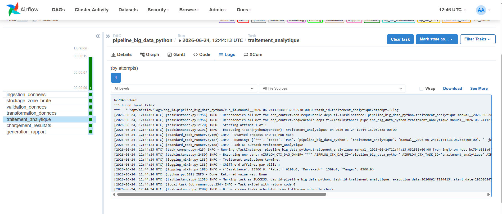

# TP6 — Atelier Apache Airflow

## Livrables

### 1. Fichier `mon_premier_dag.py`

```python
"""
Premier DAG d'initiation à Apache Airflow.
Pipeline séquentiel à trois tâches illustrant le cycle de vie
minimal d'un DAG avec PythonOperator.
"""

import pendulum
from airflow import DAG
from airflow.operators.python import PythonOperator


def debut_pipeline():
    print("Debut du pipeline Big Data")

def traitement_pipeline():
    print("Traitement en cours")
    print("Simulation d'une etape de traitement de donnees")

def fin_pipeline():
    print("Fin du pipeline Big Data")


with DAG(
    dag_id="mon_premier_dag",
    start_date=pendulum.datetime(2026, 1, 1, tz="UTC"),
    schedule=None,
    catchup=False,
    tags=["initiation", "python-operator"],
) as dag:
    debut = PythonOperator(task_id="debut", python_callable=debut_pipeline)
    traitement = PythonOperator(task_id="traitement", python_callable=traitement_pipeline)
    fin = PythonOperator(task_id="fin", python_callable=fin_pipeline)
    debut >> traitement >> fin
```

### 2. Fichier `pipeline_big_data_python.py`

```python
"""
Pipeline Big Data complet en 7 étapes séquentielles :
Ingestion → Stockage brut → Validation → Transformation →
Traitement analytique → Chargement → Rapport
"""

import csv, json, os
from datetime import timedelta
import pendulum
from airflow import DAG
from airflow.operators.python import PythonOperator

DATA_DIR = "/opt/airflow/data"
RAW_FILE = f"{DATA_DIR}/ventes_raw.csv"
CLEAN_FILE = f"{DATA_DIR}/ventes_clean.csv"
RESULT_FILE = f"{DATA_DIR}/resultats_ventes.json"
REPORT_FILE = f"{DATA_DIR}/rapport_pipeline.txt"

def ingestion_donnees():
    os.makedirs(DATA_DIR, exist_ok=True)
    ventes = [
        ["id_vente", "ville", "produit", "prix", "quantite"],
        [1, "Casablanca", "PC", 8000, 2],
        [2, "Rabat", "Clavier", 300, 5],
        [3, "Marrakech", "Souris", 150, 10],
        [4, "Casablanca", "Ecran", 2500, 3],
        [5, "Tanger", "PC", 8500, 1],
        [6, "Rabat", "Ecran", 2300, 2],
    ]
    with open(RAW_FILE, mode="w", newline="", encoding="utf-8") as f:
        writer = csv.writer(f)
        writer.writerows(ventes)
    print(f"Ingestion terminee. Fichier cree : {RAW_FILE}")

def stockage_zone_brute():
    if not os.path.exists(RAW_FILE):
        raise FileNotFoundError("Le fichier brut n'existe pas.")
    print(f"Stockage zone brute termine. Taille : {os.path.getsize(RAW_FILE)} octets")

def validation_donnees():
    if not os.path.exists(RAW_FILE):
        raise FileNotFoundError("Le fichier de donnees est introuvable.")
    with open(RAW_FILE, mode="r", encoding="utf-8") as f:
        header = next(csv.reader(f))
    colonnes_attendues = ["id_vente", "ville", "produit", "prix", "quantite"]
    if header != colonnes_attendues:
        raise ValueError("Schema incorrect")
    print(f"Validation terminee. Colonnes detectees : {header}")

def transformation_donnees():
    lignes = []
    with open(RAW_FILE, mode="r", encoding="utf-8") as f:
        for row in csv.DictReader(f):
            prix, qte = float(row["prix"]), int(row["quantite"])
            lignes.append({**row, "prix": prix, "quantite": qte, "montant": prix * qte})
    with open(CLEAN_FILE, mode="w", newline="", encoding="utf-8") as f:
        w = csv.DictWriter(f, fieldnames=["id_vente", "ville", "produit", "prix", "quantite", "montant"])
        w.writeheader(); w.writerows(lignes)
    print("Transformation terminee.")

def traitement_analytique():
    ca = {}
    with open(CLEAN_FILE, mode="r", encoding="utf-8") as f:
        for row in csv.DictReader(f):
            v = row["ville"]; ca[v] = ca.get(v, 0) + float(row["montant"])
    with open(RESULT_FILE, mode="w", encoding="utf-8") as f:
        json.dump(ca, f, indent=4, ensure_ascii=False)
    print(f"Traitement analytique termine. {ca}")

def chargement_resultats():
    if not os.path.exists(RESULT_FILE):
        raise FileNotFoundError("Resultats introuvables")
    print("Chargement termine.")

def generation_rapport():
    with open(RESULT_FILE) as f:
        resultats = json.load(f)
    with open(REPORT_FILE, mode="w", encoding="utf-8") as f:
        f.write("Rapport Big Data\n================\n\n")
        for ville, ca in resultats.items():
            f.write(f"{ville} : {ca} DH\n")
    print("Rapport genere.")

with DAG(
    dag_id="pipeline_big_data_python",
    start_date=pendulum.datetime(2026, 1, 1, tz="UTC"),
    schedule=None, catchup=False,
    default_args={"retries": 2, "retry_delay": timedelta(minutes=1)},
    tags=["big-data", "python-operator"],
) as dag:
    ingestion = PythonOperator(task_id="ingestion_donnees", python_callable=ingestion_donnees)
    stockage = PythonOperator(task_id="stockage_zone_brute", python_callable=stockage_zone_brute)
    validation = PythonOperator(task_id="validation_donnees", python_callable=validation_donnees)
    transformation = PythonOperator(task_id="transformation_donnees", python_callable=transformation_donnees)
    traitement = PythonOperator(task_id="traitement_analytique", python_callable=traitement_analytique)
    chargement = PythonOperator(task_id="chargement_resultats", python_callable=chargement_resultats)
    rapport = PythonOperator(task_id="generation_rapport", python_callable=generation_rapport)
    ingestion >> stockage >> validation >> transformation >> traitement >> chargement >> rapport
```

### 3. Fichier `pipeline_big_data_parallele.py`

```python
"""
Pipeline Big Data avec exécution parallèle (fan-out / fan-in).
Préparation → Validation → [Ville, Produit] → Rapport final
"""

import csv, json, os
import pendulum
from airflow import DAG
from airflow.operators.python import PythonOperator

DATA_DIR = "/opt/airflow/data"
CLEAN_FILE = f"{DATA_DIR}/ventes_clean.csv"
RESULT_VILLE = f"{DATA_DIR}/resultat_par_ville.json"
RESULT_PRODUIT = f"{DATA_DIR}/resultat_par_produit.json"
REPORT_FILE = f"{DATA_DIR}/rapport_parallel.txt"

def preparation_donnees():
    os.makedirs(DATA_DIR, exist_ok=True)
    ventes = [
        ["id_vente", "ville", "produit", "prix", "quantite", "montant"],
        [1, "Casablanca", "PC", 8000, 2, 16000],
        [2, "Rabat", "Clavier", 300, 5, 1500],
        [3, "Marrakech", "Souris", 150, 10, 1500],
        [4, "Casablanca", "Ecran", 2500, 3, 7500],
        [5, "Tanger", "PC", 8500, 1, 8500],
        [6, "Rabat", "Ecran", 2300, 2, 4600],
    ]
    with open(CLEAN_FILE, mode="w", newline="", encoding="utf-8") as f:
        csv.writer(f).writerows(ventes)
    print("Donnees preparees avec succes.")

def validation_donnees():
    if not os.path.exists(CLEAN_FILE):
        raise FileNotFoundError("Le fichier nettoye n'existe pas.")
    print("Validation reussie.")

def traitement_par_ville():
    ca = {}
    with open(CLEAN_FILE, encoding="utf-8") as f:
        for row in csv.DictReader(f):
            v = row["ville"]; ca[v] = ca.get(v, 0) + float(row["montant"])
    with open(RESULT_VILLE, mode="w", encoding="utf-8") as f:
        json.dump(ca, f, indent=4, ensure_ascii=False)
    print(f"Traitement par ville termine. {ca}")

def traitement_par_produit():
    ca = {}
    with open(CLEAN_FILE, encoding="utf-8") as f:
        for row in csv.DictReader(f):
            p = row["produit"]; ca[p] = ca.get(p, 0) + float(row["montant"])
    with open(RESULT_PRODUIT, mode="w", encoding="utf-8") as f:
        json.dump(ca, f, indent=4, ensure_ascii=False)
    print(f"Traitement par produit termine. {ca}")

def generation_rapport_final():
    with open(RESULT_VILLE) as f: pv = json.load(f)
    with open(RESULT_PRODUIT) as f: pp = json.load(f)
    with open(REPORT_FILE, mode="w", encoding="utf-8") as r:
        r.write("Rapport final du pipeline parallele\n==================================\n\n")
        r.write("Chiffre d'affaires par ville\n")
        for v, ca in pv.items(): r.write(f"{v} : {ca} DH\n")
        r.write("\nChiffre d'affaires par produit\n")
        for p, ca in pp.items(): r.write(f"{p} : {ca} DH\n")
    print("Rapport final genere avec succes.")

with DAG(
    dag_id="pipeline_big_data_parallele",
    start_date=pendulum.datetime(2026, 1, 1, tz="UTC"),
    schedule=None, catchup=False,
    tags=["big-data", "parallelisme", "python-operator"],
) as dag:
    preparation = PythonOperator(task_id="preparation_donnees", python_callable=preparation_donnees)
    validation = PythonOperator(task_id="validation_donnees", python_callable=validation_donnees)
    av = PythonOperator(task_id="traitement_par_ville", python_callable=traitement_par_ville)
    ap = PythonOperator(task_id="traitement_par_produit", python_callable=traitement_par_produit)
    rapport = PythonOperator(task_id="generation_rapport_final", python_callable=generation_rapport_final)
    preparation >> validation >> [av, ap] >> rapport
```

### 4. Fichier `pipeline_inscription_etudiants.py`

```python
"""
Mini-projet — Pipeline automatisé de traitement des inscriptions étudiantes.
Étapes : Réception → Stockage → Validation → Nettoyage →
         [Affectation, Statistiques] → Rapport final
"""

import pendulum
from airflow import DAG
from airflow.operators.python import PythonOperator

tasks_code = {
    "reception_fichier": "Reception du fichier des etudiants",
    "stockage_zone_brute": "Stockage du fichier dans la zone brute",
    "validation_fichier": "Validation du fichier des etudiants",
    "nettoyage_donnees": "Nettoyage des donnees",
    "affectation_groupes": "Affectation des etudiants aux groupes",
    "generation_statistiques": "Generation des statistiques",
    "rapport_final": "Generation du rapport final",
}

def make_task(msg):
    def fn():
        print(msg)
    fn.__name__ = msg
    return fn

with DAG(
    dag_id="pipeline_inscription_etudiants",
    start_date=pendulum.datetime(2026, 1, 1, tz="UTC"),
    schedule=None, catchup=False,
    tags=["mini-projet", "python-operator"],
) as dag:
    reception = PythonOperator(task_id="reception_fichier", python_callable=make_task(tasks_code["reception_fichier"]))
    stockage = PythonOperator(task_id="stockage_zone_brute", python_callable=make_task(tasks_code["stockage_zone_brute"]))
    validation = PythonOperator(task_id="validation_fichier", python_callable=make_task(tasks_code["validation_fichier"]))
    nettoyage = PythonOperator(task_id="nettoyage_donnees", python_callable=make_task(tasks_code["nettoyage_donnees"]))
    affectation = PythonOperator(task_id="affectation_groupes", python_callable=make_task(tasks_code["affectation_groupes"]))
    statistiques = PythonOperator(task_id="generation_statistiques", python_callable=make_task(tasks_code["generation_statistiques"]))
    rapport = PythonOperator(task_id="rapport_final", python_callable=make_task(tasks_code["rapport_final"]))
    reception >> stockage >> validation >> nettoyage >> [affectation, statistiques] >> rapport
```

### 5. Capture de la liste des DAGs dans l'interface Airflow


### 6. Capture de la vue Graph d'un DAG réussi


### 7. Capture des logs d'une tâche PythonOperator



---

## 8. Réponses aux questions de compréhension

### Questions sur `pipeline_big_data_python`

**Q1. Quelle est la première tâche exécutée ?**  
`ingestion_donnees` — définie en tête de la chaîne.

**Q2. Quelle est la dernière tâche exécutée ?**  
`generation_rapport` — produit `rapport_pipeline.txt`.

**Q3. Quelle tâche crée le fichier CSV brut ?**  
`ingestion_donnees` — génère `ventes_raw.csv`.

**Q4. Quelle tâche vérifie le schéma des données ?**  
`validation_donnees` — compare l'en-tête aux colonnes attendues.

**Q5. Quelle tâche calcule le chiffre d'affaires par ville ?**  
`traitement_analytique` — agrège les montants dans `resultats_ventes.json`.

**Q6. Où voir les messages `print()` ?**  
Dans les **logs** de chaque tâche (Graph → cliquer tâche → onglet Logs).

### Questions sur `pipeline_big_data_parallele`

**Q1. Quelles tâches avant le parallélisme ?**  
`preparation_donnees` puis `validation_donnees`.

**Q2. Quelles tâches en parallèle ?**  
`traitement_par_ville` et `traitement_par_produit`.

**Q3. Quelle tâche attend les deux branches ?**  
`generation_rapport_final`.

**Q4. Représentation du parallélisme dans la vue Graph ?**  
Deux flèches partent de `validation_donnees` vers les deux tâches parallèles, puis deux flèches convergent vers `generation_rapport_final` (structure en fourche).
